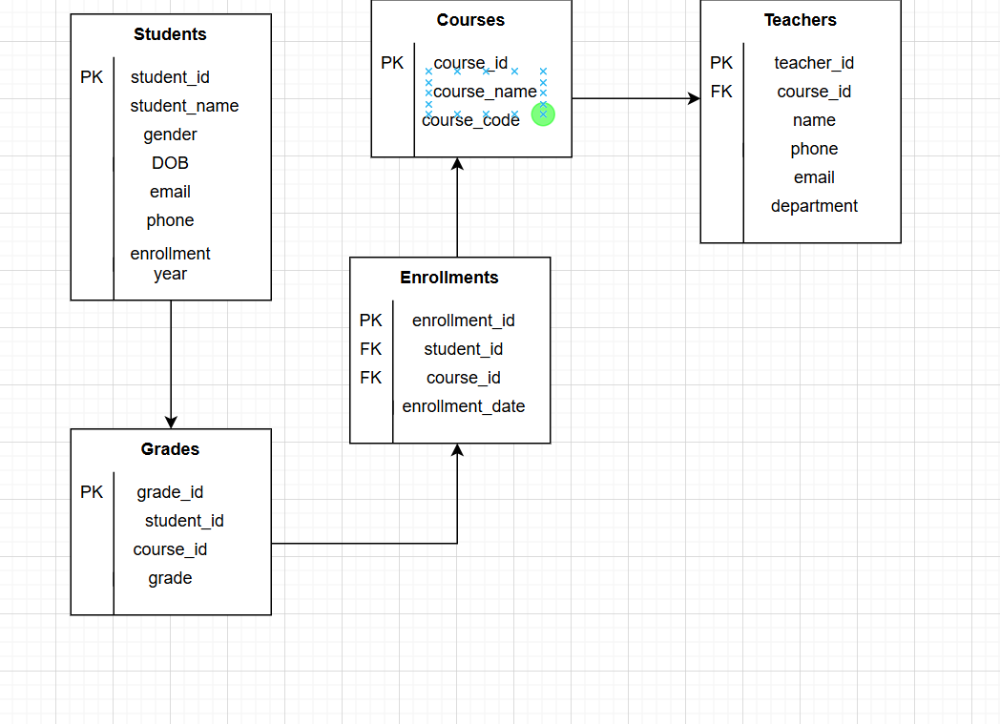

#  Student Portal API

A FastAPI-based REST API connected to a MySQL database for managing students, courses, teachers and enrollments.

## Project Description

This project simulates a basic **student portal system** that helps manage:

- Student records (name, email)
- Course records (course names)
- Enrollments (which students are taking which courses)
- Teachers 

It includes:
- Full CRUD functionality (Create, Read, Update, Delete) for students, courses, and enrollments
- A MySQL backend
- Interactive API documentation using Swagger UI (via FastAPI)

---

### Prerequisites

Make sure you have installed:

- Python 3.8+
- MySQL server
- pip (Python package installer)

## How to Run/Setup the Project
1. Clone the repository
2. Install dependencies
- pip install fastapi uvicorn mysql-connector-python
3. Update your DB credentials
conn = mysql.connector.connect(
    host="localhost",
    user="your_mysql_user",
    password="your_mysql_password",
    database="student_portal"
)

## ER-Diagram

Created by Melanie Chebet
